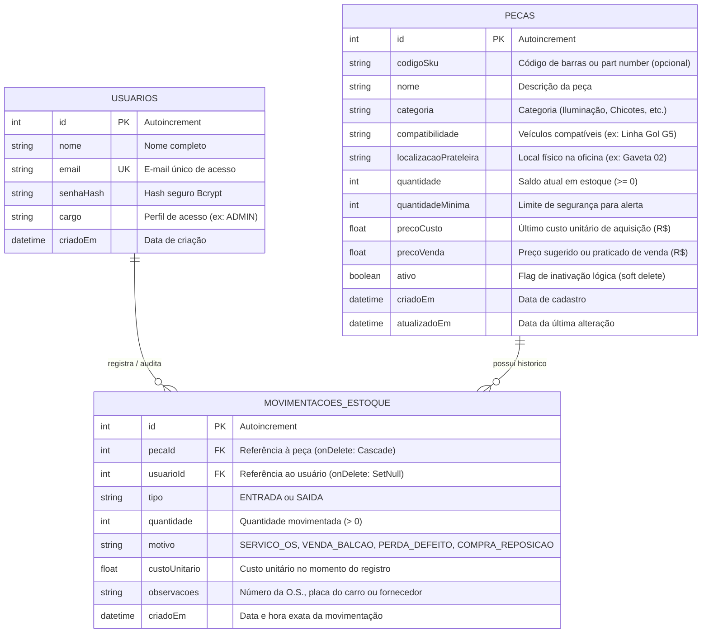

# Documentação de Arquitetura, Estrutura do Projeto e Banco de Dados

**Projeto:** Sistema Web de Gestão e Controle de Estoque  
**Cliente/Cenário Real:** Autoelétrica GUCAR (Proprietário: Gustavo Martins)  
**Contexto Acadêmico:** Projeto Integrador em Computação II (PI II) – UNIVESP  
**Stack Principal:** Next.js 14 (App Router), TypeScript, Tailwind CSS, Prisma ORM, SQLite / PostgreSQL

---

## 1. Visão Geral e Propósito do Sistema

A **Autoelétrica GUCAR** atua na manutenção preventiva e corretiva automotiva (motores de partida, alternadores, chicotes, relés, iluminação e injeção eletrônica). Em uma oficina desse porte, a ausência de peças de baixo custo (ex.: fusíveis lâmina, relés auxiliares, conectores e lâmpadas) no momento em que o veículo já está desmontado gera gargalos graves na entrega e prejuízo operacional.

O sistema foi concebido para resolver três problemas fundamentais:
1. **Acesso no Pátio (Mobile-First):** Possibilitar ao mecânico consultar prateleiras/gavetas e registrar retiradas diretamente pelo smartphone embaixo do capô.
2. **Baixa Rápida (< 3 cliques) com Integridade Transacional:** Evitar burocracia no pátio e **impedir estoque negativo** por meio de transações atômicas no banco de dados.
3. **Painel de Alertas de Reposição (Dashboard):** Identificar automaticamente itens que atingiram ou estão abaixo da margem mínima de segurança para cotação preventiva junto às distribuidoras.

---

## 2. Arquitetura e Estrutura do Projeto

O projeto adota uma arquitetura em camadas orientada a serviços (Clean Architecture pragmática com Next.js App Router), separando estritamente regras de negócio, persistência de dados, rotas de API e interface com o usuário.

```
┌────────────────────────────────────────────────────────┐
│               CAMADA DE APRESENTAÇÃO                   │
│   (Next.js App Router: Telas React, Tailwind CSS,      │
│     Componentes Responsivos e Mobile-First)            │
└───────────────────────────┬────────────────────────────┘
                            │ Requisições HTTP / Fetch
                            ▼
┌────────────────────────────────────────────────────────┐
│               SEGURANÇA & MIDDLEWARE                   │
│   (Middleware Next.js, Sessão HttpOnly, HMAC-SHA)      │
└───────────────────────────┬────────────────────────────┘
                            │
                            ▼
┌────────────────────────────────────────────────────────┐
│               CONTROLADORES REST / ROTAS               │
│   (Route Handlers: /api/pecas, /api/movimentacoes,     │
│    /api/painel, /api/auth)                             │
└───────────────────────────┬────────────────────────────┘
                            │
                            ▼
┌────────────────────────────────────────────────────────┐
│               SERVIÇOS DE DOMÍNIO (SERVICES)           │
│   (PecasService, MovimentacoesService, PainelService,  │
│    AutenticacaoService - Regras de Negócio)            │
└───────────────────────────┬────────────────────────────┘
                            │
                            ▼
┌────────────────────────────────────────────────────────┐
│               ACESSO A DADOS (ORM)                     │
│   (Prisma Client, $transaction atômica, Queries)       │
└───────────────────────────┬────────────────────────────┘
                            │
                            ▼
┌────────────────────────────────────────────────────────┐
│               BANCO DE DADOS RELACIONAL                │
│   (SQLite local dev.db / PostgreSQL em nuvem)          │
└────────────────────────────────────────────────────────┘
```

---

### 2.1 Mapeamento Detalhado de Diretórios

```
gucar-estoque/
├── prisma/                          # Modelagem e migrações do banco de dados
│   ├── schema.prisma                # Definição das tabelas (Modelos Prisma)
│   ├── seed.js                      # Carga inicial com dados automotivos reais
│   └── dev.db                       # Base SQLite local para desenvolvimento
│
├── src/
│   ├── app/                         # App Router (Páginas e Endpoints do Next.js)
│   │   ├── (dashboard)/             # Grupo de rotas autenticadas da oficina
│   │   │   ├── layout.tsx           # Shell da aplicação: Navbar superior e menu inferior mobile
│   │   │   ├── page.tsx             # Dashboard principal: KPIs operacionais e alertas críticos
│   │   │   ├── pecas/
│   │   │   │   ├── page.tsx         # Catálogo com busca instantânea e localização física
│   │   │   │   ├── nova/page.tsx    # Formulário de cadastro de nova peça
│   │   │   │   └── [id]/page.tsx    # Edição, inativação lógica e histórico da peça
│   │   │   └── movimentacoes/
│   │   │       ├── page.tsx         # Histórico e auditoria de entradas e saídas
│   │   │       ├── saida/page.tsx   # Baixa Rápida de Peça no Pátio (< 3 cliques)
│   │   │       └── entrada/page.tsx # Registro de chegada de mercadoria / reposição
│   │   │
│   │   ├── api/                     # Camada de Controladores REST (Route Handlers)
│   │   │   ├── auth/                # Login, Logout e status da sessão ativa
│   │   │   ├── pecas/               # Endpoints de listagem, criação, edição e inativação
│   │   │   ├── movimentacoes/       # Endpoints de movimentação (entrada e baixa de estoque)
│   │   │   ├── painel/              # Métricas consolidadas em tempo real para o dashboard
│   │   │   ├── products/            # Adaptadores legados para retrocompatibilidade
│   │   │   ├── movements/           # Adaptadores legados para retrocompatibilidade
│   │   │   └── dashboard/           # Adaptadores legados para retrocompatibilidade
│   │   │
│   │   ├── login/
│   │   │   └── page.tsx             # Tela de login responsiva da Autoelétrica
│   │   ├── globals.css              # Configurações globais e diretivas do Tailwind CSS
│   │   └── layout.tsx               # Layout raiz com fontes e metadados HTML
│   │
│   ├── components/                  # Componentes visuais reutilizáveis
│   │   ├── Navbar.tsx               # Header desktop e barra de navegação inferior mobile (estilo App)
│   │   ├── CardKpi.tsx              # Cards informativos de indicadores (KPIs)
│   │   └── BadgeStatusEstoque.tsx   # Identificador visual de estoque normal, crítico ou esgotado
│   │
│   ├── services/                    # Camada de Domínio / Casos de Uso (Regras de Negócio)
│   │   ├── pecas.service.ts         # Regras de cadastro, filtragem e inativação de peças
│   │   ├── movimentacoes.service.ts # Regra transacional de baixa e bloqueio de saldo negativo
│   │   ├── painel.service.ts        # Cálculo consolidado de indicadores operacionais
│   │   └── autenticacao.service.ts  # Verificação de credenciais e geração de credenciais
│   │
│   ├── lib/                         # Utilitários e infraestrutura compartilhada
│   │   ├── prisma.ts                # Instância Singleton do cliente Prisma
│   │   ├── auth.ts                  # Criptografia de senhas (bcrypt) e tokens de sessão
│   │   └── formatadores.ts          # Formatação de moeda (BRL R$), datas e rótulos PT-BR
│   │
│   ├── middleware.ts                # Proteção perimetral de rotas (Guarda de rotas autenticadas)
│   └── types/
│       └── index.ts                 # Interfaces e tipos estritos TypeScript em Português
│
├── .env                             # Variáveis de ambiente (DATABASE_URL, JWT_SECRET)
├── package.json                     # Dependências e scripts de execução
├── tsconfig.json                    # Configurações do compilador TypeScript
└── verify_system.js                 # Script de testes automatizados de integração
```

---

## 3. Estrutura do Banco de Dados

O banco de dados relacional é orquestrado pelo **Prisma ORM**, garantindo integridade referencial, tipagem forte e portabilidade transparente entre **SQLite** (ambiente local) e **PostgreSQL** (ambiente em nuvem/produção).

### 3.1 Diagrama Entidade-Relacionamento (DER)



---

### 3.2 Dicionário de Dados

#### Tabela `usuarios` (Entidade: `Usuario`)
Armazena os profissionais autorizados a operar o sistema.

| Coluna | Tipo Prisma | Tipo SQL | Chave / Restrição | Descrição |
|---|---|---|---|---|
| `id` | `Int` | `INTEGER` | **PK**, Auto Increment | Identificador único do usuário. |
| `nome` | `String` | `VARCHAR/TEXT` | `NOT NULL` | Nome completo do usuário. |
| `email` | `String` | `VARCHAR/TEXT` | `NOT NULL`, **UNIQUE** | E-mail de autenticação no sistema. |
| `senhaHash` | `String` | `VARCHAR/TEXT` | `NOT NULL` | Hash da senha gerado com algoritmo Bcrypt (cost 10). |
| `cargo` | `String` | `VARCHAR/TEXT` | `DEFAULT 'ADMIN'` | Perfil de permissão do usuário. |
| `criadoEm` | `DateTime` | `TIMESTAMP` | `DEFAULT now()` | Timestamp de registro no banco. |

---

#### Tabela `pecas` (Entidade: `Peca`)
Catálogo de componentes elétricos e eletrônicos disponíveis na oficina.

| Coluna | Tipo Prisma | Tipo SQL | Chave / Restrição | Descrição |
|---|---|---|---|---|
| `id` | `Int` | `INTEGER` | **PK**, Auto Increment | Identificador único da peça. |
| `codigoSku` | `String?` | `VARCHAR/TEXT` | Opcional | Código comercial, de barras ou part number do fabricante (ex: `DNI-0101`, `PHIL-H7`). |
| `nome` | `String` | `VARCHAR/TEXT` | `NOT NULL` | Nome comercial e técnico do componente. |
| `categoria` | `String` | `VARCHAR/TEXT` | `NOT NULL` | Categoria de organização (ex: *Iluminação, Fusíveis, Chicotes, Alternadores, Ignição*). |
| `compatibilidade` | `String` | `VARCHAR/TEXT` | `NOT NULL` | Aplicação veicular (ex: *Universal, Gol G5, Fox, Palio Fire*). |
| `localizacaoPrateleira` | `String` | `VARCHAR/TEXT` | `NOT NULL` | Endereço físico na oficina (ex: *Prateleira A, Gaveta 01*). Essencial para agilidade do mecânico. |
| `quantidade` | `Int` | `INTEGER` | `DEFAULT 0` | Saldo físico atual em estoque. Não pode ser negativo. |
| `quantidadeMinima` | `Int` | `INTEGER` | `DEFAULT 2` | Estoque de segurança. Quando `quantidade <= quantidadeMinima`, o item entra no alerta de compra do Dashboard. |
| `precoCusto` | `Float` | `REAL/DOUBLE` | `DEFAULT 0.0` | Valor unitário pago na aquisição da peça. |
| `precoVenda` | `Float` | `REAL/DOUBLE` | `DEFAULT 0.0` | Valor unitário cobrado na aplicação ou balcão. |
| `ativo` | `Boolean` | `BOOLEAN` | `DEFAULT true` | Inativação lógica (*soft delete*). Evita exclusão física para não corromper histórico de movimentações passadas. |
| `criadoEm` | `DateTime` | `TIMESTAMP` | `DEFAULT now()` | Data e hora do cadastro inicial. |
| `atualizadoEm` | `DateTime` | `TIMESTAMP` | `@updatedAt` | Atualizado automaticamente a cada edição. |

---

#### Tabela `movimentacoes_estoque` (Entidade: `MovimentacaoEstoque`)
Registro cronológico e imutável de todas as transações de entrada e saída.

| Coluna | Tipo Prisma | Tipo SQL | Chave / Restrição | Descrição |
|---|---|---|---|---|
| `id` | `Int` | `INTEGER` | **PK**, Auto Increment | Identificador único do registro de auditoria. |
| `pecaId` | `Int` | `INTEGER` | **FK** (`pecas.id`) | Peça que sofreu a movimentação. Se a peça for excluída fisicamente, remove em cascata (`onDelete: Cascade`). |
| `usuarioId` | `Int?` | `INTEGER` | **FK** (`usuarios.id`), Opcional | Usuário responsável pela operação. Se o usuário for removido, mantém o log preservado (`onDelete: SetNull`). |
| `tipo` | `String` | `VARCHAR/TEXT` | `NOT NULL` | Natureza do fluxo: `'ENTRADA'` ou `'SAIDA'`. |
| `quantidade` | `Int` | `INTEGER` | `NOT NULL` | Número de unidades movimentadas (deve ser maior que zero). |
| `motivo` | `String` | `VARCHAR/TEXT` | `NOT NULL` | Motivo de negócio: `'SERVICO_OS'`, `'VENDA_BALCAO'`, `'PERDA_DEFEITO'` ou `'COMPRA_REPOSICAO'`. |
| `custoUnitario` | `Float?` | `REAL/DOUBLE` | Opcional | Custo unitário registrado no momento da transação. |
| `observacoes` | `String?` | `VARCHAR/TEXT` | Opcional | Informações complementares: Número da Ordem de Serviço (O.S.), placa do veículo ou fornecedor. |
| `criadoEm` | `DateTime` | `TIMESTAMP` | `DEFAULT now()` | Timestamp imutável de quando a ação ocorreu. |

---

## 4. Regras de Negócio Implementadas no Banco e Serviços

### 4.1 Bloqueio Estrito de Saldo Negativo (Transação Atômica)
Para garantir integridade física e contábil, uma saída nunca pode resultar em saldo negativo. A operação de baixa utiliza o método `prisma.$transaction`:

```typescript
// Exemplo conceitual implementado em MovimentacoesService.registrarSaida:
await prisma.$transaction(async (tx) => {
  const peca = await tx.peca.findUnique({ where: { id: pecaId } });
  
  if (!peca) throw new Error('Peça não encontrada.');
  
  // Regra crítica: se o saldo for insuficiente, aborta a transação inteira
  if (peca.quantidade < quantidade) {
    throw new Error(`Estoque insuficiente! Saldo atual é de ${peca.quantidade}, você tentou baixar ${quantidade}.`);
  }

  // 1. Atualiza saldo da peça
  await tx.peca.update({
    where: { id: pecaId },
    data: { quantidade: peca.quantidade - quantidade },
  });

  // 2. Registra o log de auditoria
  await tx.movimentacaoEstoque.create({
    data: { pecaId, usuarioId, tipo: 'SAIDA', quantidade, motivo, observacoes },
  });
});
```

### 4.2 Inativação Lógica (*Soft Delete*)
Para manter o histórico contábil das movimentações já realizadas, peças descontinuadas não sofrem `DELETE` físico. O campo `ativo` é alterado para `false`, excluindo o item das listagens ativas, mas preservando relatórios e logs antigos.

### 4.3 Cálculo de Alerta de Estoque Crítico
Um item é classificado como crítico no Dashboard sempre que:
$$\text{quantidade} \le \text{quantidadeMinima}$$
O painel exibe um aviso em vermelho para compra preventiva imediata, permitindo com um clique abrir a tela de entrada preenchida.

---

## 5. Estratégia de Ambientes: SQLite vs. PostgreSQL

1. **Desenvolvimento Local (Zero Setup):**
   * Configurado via SQLite (`file:./dev.db`).
   * Permite clonar o repositório e rodar imediatamente sem necessidade de instalar servidores externos de banco.
2. **Homologação e Produção (Nuvem / Vercel):**
   * Plataformas como a Vercel utilizam funções *serverless* com sistema de arquivos efêmero (somente leitura).
   * Para deploy permanente, basta alterar o arquivo `prisma/schema.prisma`:
     ```prisma
     datasource db {
       provider = "postgresql"
       url      = env("DATABASE_URL")
     }
     ```
   * E apontar a variável `DATABASE_URL` no `.env` para um banco em nuvem gerenciado gratuito (ex.: **Supabase**, **Neon** ou **Railway**).

---

## 6. Dados de Teste e Validação (Seed)

O arquivo `prisma/seed.js` popula o banco com os dados operacionais da oficina:
* **Usuário:** Gustavo Martins (`gustavo@gucar.com.br` / senha: `gucar@123`).
* **12 Peças Reais de Autoelétrica:** Relé auxiliar DNI, lâmpadas H4 e H7, kit de fusíveis lâmina, alternador Bosch Gol EA111, chicotes de bico injetor, etc.
* **Movimentações Iniciais:** Entradas e saídas vinculadas para teste dos gráficos e indicadores.
* **Testes de Integração:** O script automatizado `verify_system.js` executa 13 testes de integração validando regras de login, integridade de saldo, bloqueio negativo e filtros.
